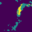

[](https://github.com/ellerbrock/open-source-badges/)

## The implemntation of FCN on Geological data

- The model is based on CVPR '15 best paper honorable mentioned [Fully Convolutional Networks for Semantic Segmentation](https://arxiv.org/abs/1411.4038)

## Results
### RGB bands
#### Ground truth
<p float="left">
  </img>
  </img>
  </img>
  </img>
  </img>
</p>


#### Prediction
<p float="left">
  </img>
  </img>
  </img>
  </img>
  </img>
</p>

### Mulrispectral bands
#### Ground truth
<p float="left">
  </img>
  </img>
  </img>
  </img>
  </img>
</p>


#### Prediction
<p float="left">
  </img>
  </img>
  </img>
  </img>
  </img>
</p>


## Performance

I train with custom satellite images dataset

|    Bands    | Pixel Accuracy|Best IOU|
|-------------|:-------------:|-------:|
|Multispectral|      90%      |  0.57  |
|     RGB     |      70%      |  0.52  |

## Training

### Install packages
```bash
pip install -r requirements.txt
```

### Run the code
- Train with RGB band

```python
python train_fcn.py --data-dir "<Path to data directory>" --num-epochs 50 --use-pretrained False --checkpoint-dir "<Path to checkpoint directory if pretrained is true>"
```

- Train with RGB band

```python
python train_fcn_multispectral.py --data-dir "<Path to data directory>" --num-epochs 50 --use-pretrained False --checkpoint-dir "<Path to checkpoint directory if pretrained is true>"
```

## Inference
- Infer with default 10 samples

```python
python inference_rgb --data-dir "<Path to test data directory>" --results-dir "<Path to result directory>" --test-count 10 --checkpoint-dir "<Path to checkpoint directory if pretrained is true>"
```

```python
python inference_multispectral --data-dir "<Path to test data directory>" --results-dir "<Path to result directory>" --test-count 10 --checkpoint-dir "<Path to checkpoint directory if pretrained is true>"
```